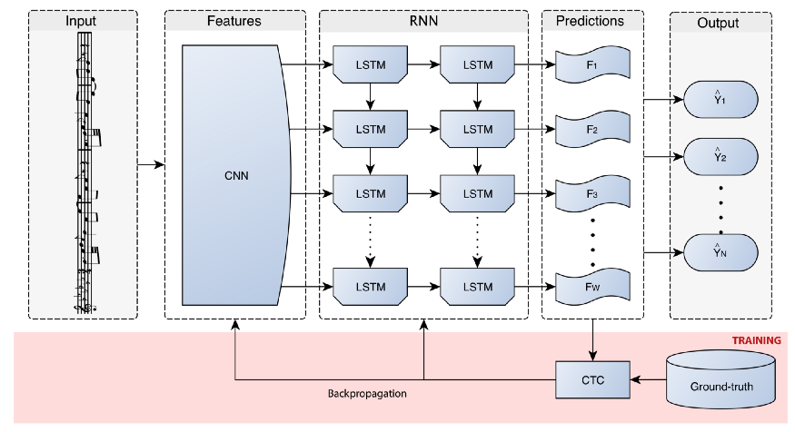

# Optical-Music-Recognition
Optical Music Recognition is a method of identifiying the musical notes in a musical sheet making it easier for the people playing the music to know which note they shuold be playing.

The model contains a CNN to identify where the musical notes are present in the image and the RNN is used to identify which type of note is being used.

